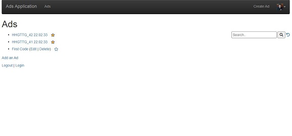
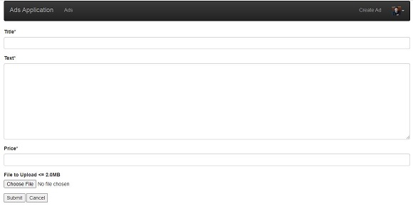
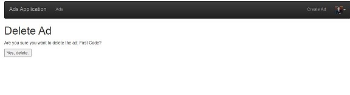
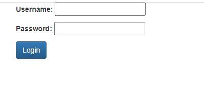

#### **This repo contains all the online course projects completed.**

### CRUD(Create, Read , Update and Delete) Application using *php, Javascript and jQuery*
___
__For Logging In: Email- joy.krishan@funny.com Pass- php123__
___
1. Simple Autos Application to keep record of different model of automobiles. [Click Here to Visit]()
1. Profiles, Position and Education Application to keep record of the multiple users. [Click Here to Visit]()

>>**Note the Link to the Applications will only work if I host the projects from my Laptop**

### Django CRUD Applications using JavaScript, jQuery
___
__For Logging In: Username- JoyKrishanDas Pass- djangoisfun__
___
1. Classified Ads Application where you can post advertisements with details and picture. The Owner of the add can delete, update his ad. However, other users can add comments to all ads posted on the website. [Click Here to Visit]()

>> **Note the Link to the Applications will only work if I host the projects from my Laptop**

### You can check some of snapshots of the Classified Ads Application
* Homepage

* Addpage

* Editpage

* Deletepage

* Loginpage 

